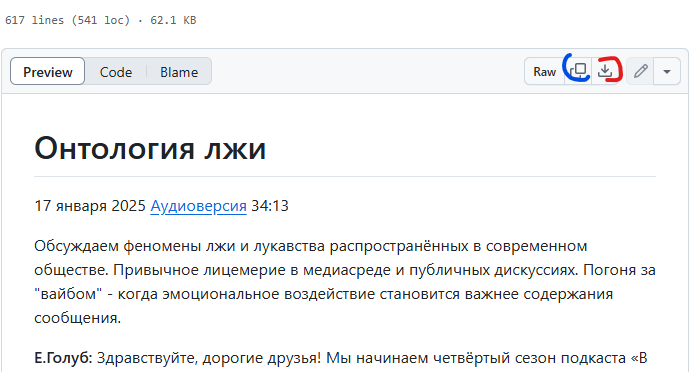

# Инструкция для желающих помочь в обработке машинного перевода

Перейдите на [корневую страницу](https://github.com/vb64/meanings.self.evident/blob/main/content/InSearchOfMeaning/README.md) проекта.

По ссылкам сезонов и выпусков выберите интересующий вас выпуск.

Нажмите одну из отмеченных на скриншоте кнопок.

Отмеченная синим кнопка скопирует текст выпуска в буфер обмена.

Отмеченная красным кнопка загрузит файл с тестом выпуска на ваш компьютер.

Вы получите текст, который можно редактировать любым текстовым редактором.
Например "Блокнот" ("Notepad").

По окончании работы над текстом отправьте соответствующий файл в ветку ["Редакция (Транскрибирование)"](https://t.me/c/1923776800/371293)
группы "Смыслы самоочевидного" в мессенджере Telegram.

В этой же ветке группы можно задать вопросы, если возникнут трудности.
