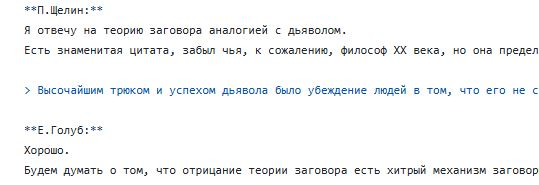
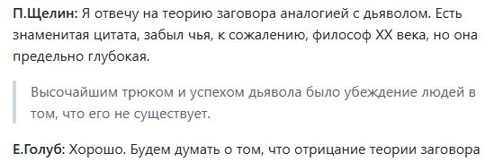
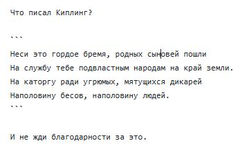
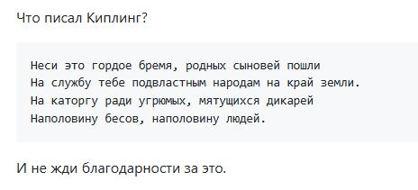

# Требования по оформлению стенограммы в формате markdown

## Формат markdown

Открываться в программе Блокнот (не MS Word!).
Подробное описание [формата markdown](https://gist.github.com/Jekins/2bf2d0638163f1294637).

## Имена собеседников

Машинный перевод содержит разбиение на части по именам собеседников.
Имя собеседника указывается на отдельной строке и обрамляется с двух сторон двойными звездочками.

Если какая-то фраза сказана другим собеседником, перед ней нужно добавить строку с именем собеседника и отделить пустой строкой от текста другого собеседника.

## Разбиение на абзацы

Каждое предложение стенограммы должно быть на отдельной строке.
При отображении строки группируются в один абзац.

Разбиение большого куска текста на смысловые абзацы можно делать добавлением пустых строк.

## Цитаты

При использовании одним из собеседников длинных нерифмованных цитат, такие цитаты можно выделять правой угловой скобкой в первой позиции строки.


_Редактирование цитаты_


_Отображение цитаты_

## Стихи

Стихотворения и цитаты Библии для правильного разбиения по строкам нужно обрамлять тройным символом обратного апострофа (буква ё в русской раскладке).


_Редактирование стиха_


_Отображение стиха_

## Неразборчивые фрагменты

Если в аудиозаписи присутствуют фрагменты неразборчивой речи, то в стенограмме в этом месте должно быть слово "неразборчиво", обрамленное символами подчеркивания.

```
_неразборчиво_
```
